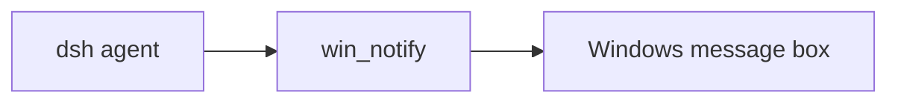

# dsh-wsl-notify
> **Install set:** part of [dsh-wsl-kit](https://github.com/173787247/dsh-wsl-kit). Prefer `KIT_SET=daily` | `llm` | `github` | `full` (see kit README). Fault tree: [TROUBLESHOOTING.md](https://github.com/173787247/dsh-wsl-kit/blob/master/docs/TROUBLESHOOTING.md).


DeepSeek Harness tool: **`win_notify`** — show a short **Windows MessageBox** when a long WSL task finishes.

Part of **[dsh-wsl-kit](https://github.com/173787247/dsh-wsl-kit)**.

[中文说明 → README.zh.md](./README.zh.md)

## Where it sits

Shows a Windows message box from the agent in WSL.



Suite diagram and version snapshot: [dsh-wsl-kit](https://github.com/173787247/dsh-wsl-kit#how-the-pieces-fit). This plugin is **0.1.0** (github). Do not copy that matrix into this README.


---
## Compatibility

| Field | Value |
|-------|-------|
| **Plugin** | `dsh-wsl-notify` **0.1.0** |
| **Minimum dsh** | ≥ **0.1.2** (web UI one-shot `?token=` on Windows relay `:3081`) |
| **Latest verified** | See [dsh-wsl-kit Compatibility](https://github.com/173787247/dsh-wsl-kit#compatibility-2026-09) (currently **`0.1.7-alpha.2`**) — single source of truth for the suite |
| **Kit set** | `github` / `full` |
| **Cloud Flash** | Use model id **`deepseek-flash`** (V4.1 Flash) in `~/.dsh/settings.yaml` / `llm-deepseek` — not configured by this plugin |
| **Agent Teams** | Upstream experimental; not required here |

Suite floor versions: kit [`check-plugin-versions.sh`](https://github.com/173787247/dsh-wsl-kit/blob/master/scripts/check-plugin-versions.sh). Fault tree: [TROUBLESHOOTING.md](https://github.com/173787247/dsh-wsl-kit/blob/master/docs/TROUBLESHOOTING.md).

## Why

You leave a long agent run in the background; when it finishes, a Windows popup is easier to notice than a tab title.

**Note:** MessageBox is **blocking** until dismissed. Keep title/body short; no secrets. For non-blocking toasts you can later swap the implementation; this release prioritizes reliability without extra Windows modules.

## Tool

| Arg | Default | Meaning |
|-----|---------|---------|
| `title` | `DSH` | Window title (`maxLen`) |
| `body` | `Task finished.` | Message body |

## Install

```sh
dsh plugin --profile web add github:173787247/dsh-wsl-notify
```

## Config

```yaml
- id: dsh-wsl-notify
  name: dsh-wsl-notify
  config:
    timeoutMs: 30000
    maxLen: 500
```

## Test

```sh
npm test
```

## License

MIT
