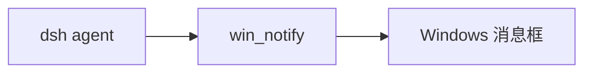

# dsh-wsl-notify
> **套件安装：** 见 [dsh-wsl-kit](https://github.com/173787247/dsh-wsl-kit)。推荐 `KIT_SET=daily` | `llm` | `github` | `full`。故障树：[TROUBLESHOOTING.zh.md](https://github.com/173787247/dsh-wsl-kit/blob/master/docs/TROUBLESHOOTING.zh.md)。


DeepSeek Harness 工具：**`win_notify`** — 长 WSL 任务结束时弹出简短的 **Windows MessageBox**。

属于 **[dsh-wsl-kit](https://github.com/173787247/dsh-wsl-kit)**。

[English → README.md](./README.md)

## 在套件里的位置

从 WSL 里的 agent 弹出 Windows 消息框。



整套关系图和版本快照：[dsh-wsl-kit 中文说明](https://github.com/173787247/dsh-wsl-kit/blob/master/README.zh.md)。本插件是 **0.1.0**（github）。不要把那份总表抄进本 README。


---
## 兼容性

| 项 | 值 |
|----|----|
| **插件** | `dsh-wsl-notify` **0.1.0** |
| **最低 dsh** | ≥ **0.1.2**（Windows 中继 `:3081` 一次性 `?token=`） |
| **最新验证** | 以 [dsh-wsl-kit 兼容性](https://github.com/173787247/dsh-wsl-kit#compatibility-2026-09) 为准（当前 **`0.1.7-alpha.2`**）— 套件唯一真源 |
| **套件档位** | `github` / `full` |
| **云端 Flash** | settings / `llm-deepseek` 使用 **`deepseek-flash`**（V4.1 Flash）；本插件不配置模型 id |
| **Agent Teams** | 上游实验包；本插件不依赖 |

套件版本地板：[`check-plugin-versions.sh`](https://github.com/173787247/dsh-wsl-kit/blob/master/scripts/check-plugin-versions.sh)。故障树：[TROUBLESHOOTING.zh.md](https://github.com/173787247/dsh-wsl-kit/blob/master/docs/TROUBLESHOOTING.zh.md)。

## 为什么需要

长任务在后台跑完时，Windows 弹窗比盯浏览器标签更醒目。

**注意：** 当前实现是 **MessageBox（需点确定后才返回）**。标题和正文保持简短，勿含密钥。非阻塞 toast 以后可以换实现；本版本优先可靠、不额外依赖 Windows 模块。嫌打扰可不装或少用。

## 工具

| 参数 | 默认 | 含义 |
|------|------|------|
| `title` | `DSH` | 窗口标题（受 `maxLen` 限制） |
| `body` | `Task finished.` | 正文 |

## 安装

```sh
dsh plugin --profile web add github:173787247/dsh-wsl-notify
```

## 配置

```yaml
- id: dsh-wsl-notify
  name: dsh-wsl-notify
  config:
    timeoutMs: 30000
    maxLen: 500
```

## 测试

```sh
npm test
```

## 许可

MIT
